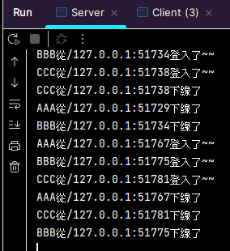
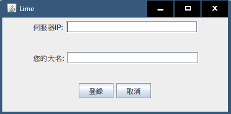
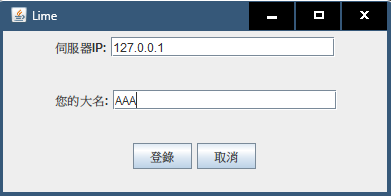
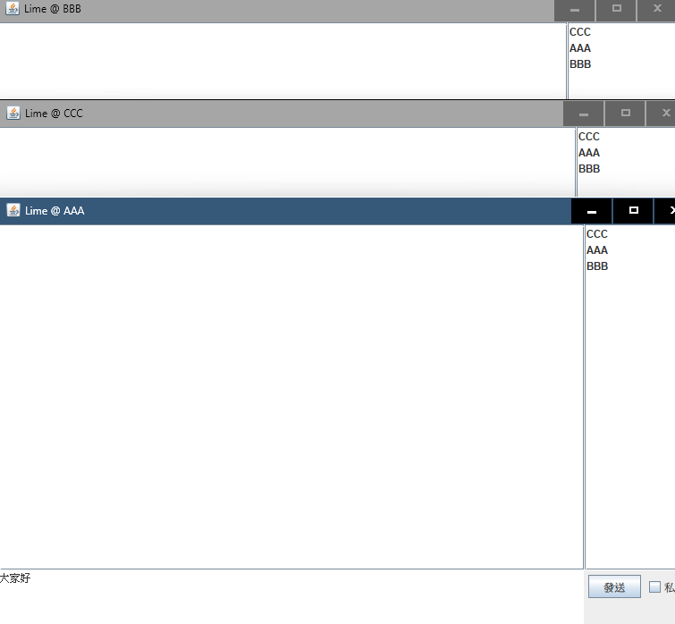
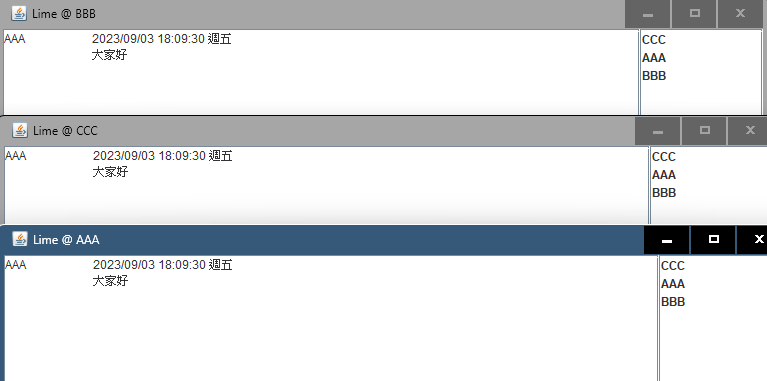
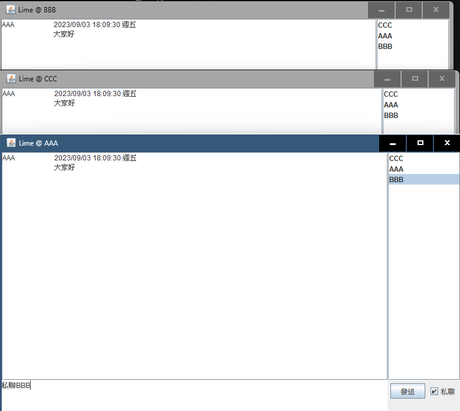
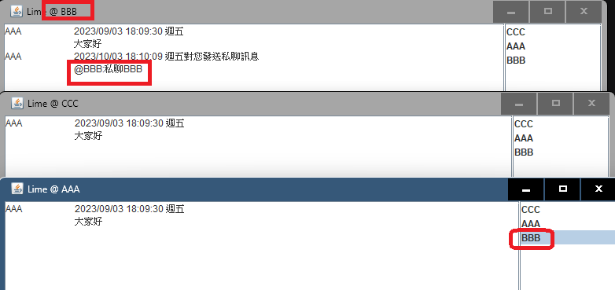
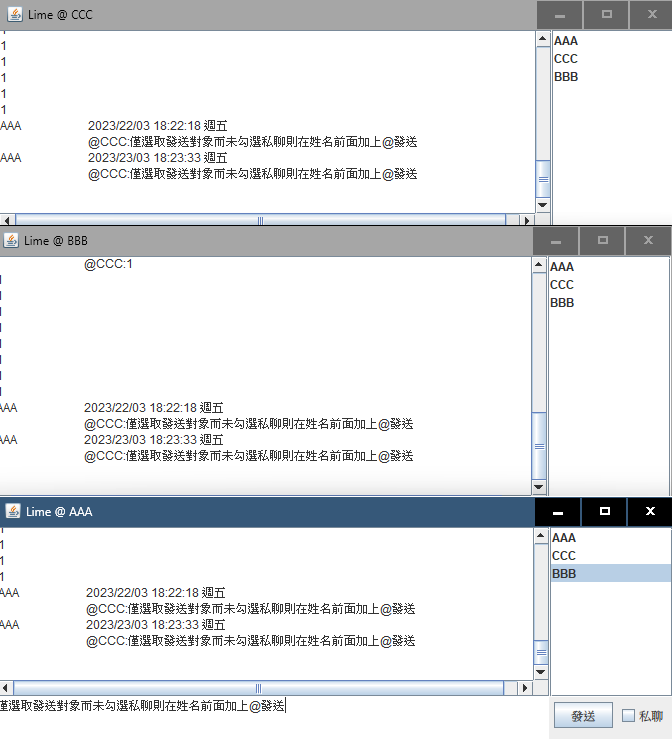
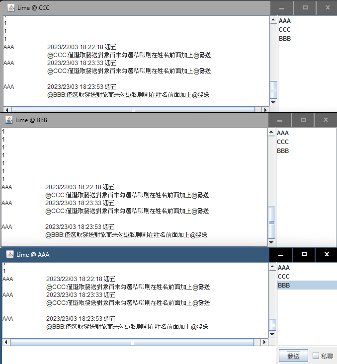

# 說明文件

## 說明

* Lime是一款使用Java圖形化介面模擬通訊軟體功能的練習作品，使用者連接伺服器可進行群聊或私聊
* 練習內容包含IO流、網路編程(socket)、多線程、Swing之運用等
  
## 功能展開

### 伺服器啟動

伺服器端程序啟動，並於控制台顯示狀態，包含用戶登入或離線等

### 用戶登入

用戶輸入伺服器所在位置(本地端為127.0.0.1)，並輸入用戶名稱進行登入

### 用戶聊天

用戶可進行群聊或私聊，私聊部分須於右側在線用戶清單選擇發送對象並於右下方勾選私聊方塊

#### 群聊

#### 私聊

#### Tag

